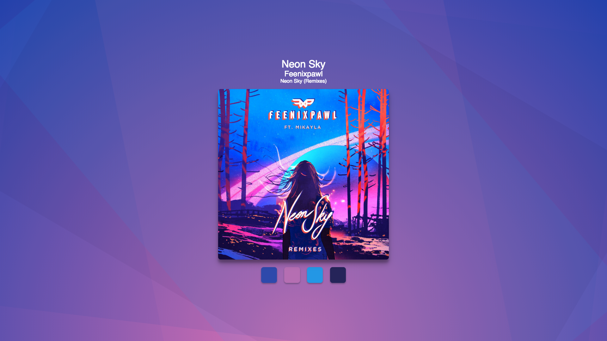

## About
#### A react webapp that syncs your Philips Hue lights with the most prominent colors in the album art for your currently playing Spotify track.



## Installation

```bash
yarn rebuild
```

## Get started

```bash
SPOTIFY_CLIENT_SECRET=***** yarn dev
```

Open up `/common/constants/authorization.js` and change the variables in that file to match your Philips and Spotify config. Note that the `SPOTIFY_CLIENT_SECRET` variable MUST be passed to your app as an environment variable.
If you don't already have a Spotify developer account you can get one here: https://developer.spotify.com/dashboard/applications

Open up `/client/src/containers/AlbumContainer.js` and find these lines:

```javascript
const numberOfColors = 4;
const lampIds = [1, 2, 3, 4];
```

Edit these to your preference.

`numberOfColors` determines how many colors to pull out of the album art.

`lampIds` is the array of Philips Hue light ids. Add up to four ids to this array. The order of the ids in this array is the order in which hues will be prioritized. This project will attempt to give higher priority to colors that "work well" with the range of colors that Philips Hue lights support. Typically such colors are as far from black or white as possible.

## Scripts
| Script | Description |
|---|---|
| rebuild | Nuke the client and server node_modules then reinstall everything |
| dev | Concurrently run the client and server in development mode |

## Attribution
This boilerplate is built using [create-react-app](https://github.com/facebookincubator/create-react-app) so you will want to read the User Guide for more goodies.
